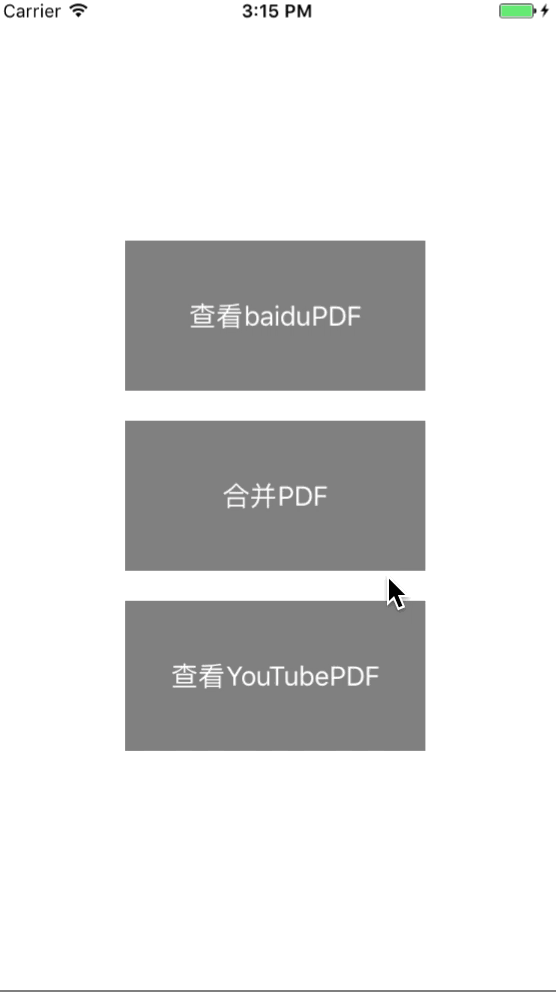

# mergePDFsynthesize
mergePDFsynthesize  PDF的合成 PDF合并工具


<br /><br />

####效果如下<br />
<br /><br />

<br />
####特性：<br />
>1.拼接pdf文件<br />
>2.支持多个文件
支持iOS7及以上
以上演示的是2个pdf合成为一个pdf

<br />
####用法：<br />


```objective-c

- (NSString *)joinPDF:(NSArray *)listOfPaths;

调用此方法即可

```
